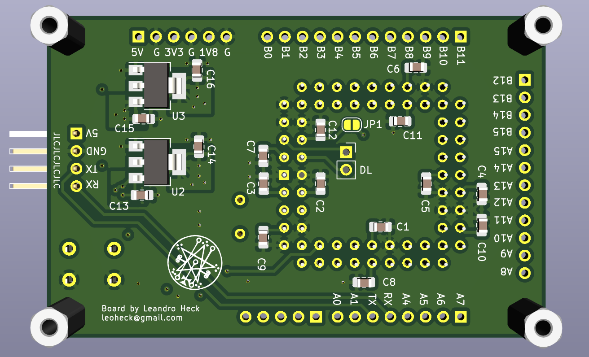

# ASSoC Evaluation Board

Small and simple evaluation board for the ASSoC IC.
ASSoC IC private project can be accessed [here](https://lesvos.pucrs.br/assoc/assoc). 

The IC is accessible through a USB-Serial dongle connected to the computer. The default symbol rate for 25 MHz clock is 11520 Bd (baud rate).

- Board [schematics](board-schematic.pdf)
- Assembly [Bill of Materials](board-bom.csv)
- Production files [Release-0.1](https://github.com/leoheck/assoc-board/releases/tag/0.1)

> This project uses Kicad 5.1.6

The library in this project is a git submodule.
Update/clone the library with the following command:

```
git submodule update --init --recursive
```

# Known issues

The ASSoC IC has some issues related to the interconnection of the power rails and the pads. At this moment it is not known if it works properly. This board will be used to investigate these issues and maybe bring it to life. 

# Pictures


